# Inside Claude's Chrome Extension: How Anthropic Built Browser Automation for AI

*I used Claude Code CLI to reverse-engineer the official Claude Chrome extension. Here's what I discovered about how they built "Computer Use" for the browser.*

---

## The Journey Begins

Like many developers, I was curious about how Anthropic's Claude Chrome extension actually works under the hood. How does an AI "see" a web page? How does it click buttons and fill forms? What makes it different from simple web scraping?

So I did what any curious engineer would do: I pointed Claude Code CLI at my local extension files and asked it to help me understand the implementation. What I discovered was fascinating—and surprisingly elegant.

```bash
# The extension lives here on macOS
cd ~/Library/Application\ Support/BraveSoftware/Brave-Browser/Default/Extensions/fcoeoabgfenejglbffodgkkbkcdhcgfn/1.0.31_0

# Let Claude Code help me explore
claude-code
```

Within minutes, Claude Code was reading through the minified JavaScript bundles, explaining the architecture, and helping me piece together how everything works. It's meta—using Claude to understand Claude.

---

## The Architecture: More Than Just Web Scraping

The extension isn't just scraping HTML or taking screenshots. It's a sophisticated **multi-context orchestration system** that coordinates several execution environments:

```mermaid
graph TB
    subgraph "Chrome Browser"
        User[👤 User] -->|Cmd+E| SP[Side Panel<br/>React App]
        SP <-->|Messages| SW[Service Worker<br/>Background Orchestrator]
        SW <-->|CDP Commands| Tab[Active Tab]
        SW <-->|Messages| CS[Content Scripts<br/>In Every Page]
        SW <-->|Audio| OS[Offscreen Document<br/>Sound Player]

        CS -->|Inject| AT[Accessibility Tree<br/>Generator]
        CS -->|Inject| VI[Visual Indicators<br/>Orange Border]

        Tab -->|Debugger API| CDP[Chrome DevTools<br/>Protocol]
    end

    SP -->|API Calls| API[Anthropic API<br/>Claude Models]

    style SP fill:#f9f,stroke:#333,stroke-width:2px
    style SW fill:#bbf,stroke:#333,stroke-width:2px
    style CDP fill:#fbb,stroke:#333,stroke-width:2px
    style AT fill:#bfb,stroke:#333,stroke-width:2px
```



This architecture solves a fundamental problem: **how do you give an AI agent reliable control over a web browser?**

---

## The Brilliant Part: Accessibility Trees

Here's where it gets interesting. Most automation tools either:
1. **Parse the full DOM** (heavy, noisy, hard to reason about)
2. **Use computer vision** (expensive, slow, can miss interactive elements)

Anthropic chose a third path: **accessibility trees**.

### What's an Accessibility Tree?

The extension injects a function into every page that generates a structured, text-based representation of interactive elements:

```javascript
window.__generateAccessibilityTree = function(options) {
  // Walks the DOM and builds a tree of meaningful elements
  // Returns something like this:

  - button "Submit" [ref=ref_123] (x=450,y=300) id="submit-btn"
  - textbox "Email" [ref=ref_124] (x=400,y=250) placeholder="Enter email"
  - link "Learn more" [ref=ref_126] (x=100,y=500) href="/about"
}
```

### Why This Is Clever

**Lightweight:** Instead of sending the entire DOM (kilobytes to megabytes), you send a few hundred bytes of structured text.

**Semantic:** Every element has a role (`button`, `textbox`, `link`), label, and position. Claude can reason about what elements *do*, not just what they look like.

**Targetable:** Each element gets a unique `ref_123` identifier and `(x, y)` coordinates. When Claude decides "I need to click the submit button," it has everything needed to execute that action.

**Memory-safe:** Uses JavaScript `WeakRef` so element references don't prevent garbage collection. Critical for content scripts that run indefinitely.

Here's how it works:


---

## The Power Move: Chrome DevTools Protocol

Here's the second brilliant decision. Instead of simulating clicks with JavaScript (`element.click()`), the extension uses the **Chrome DevTools Protocol (CDP)**—the same API that Chrome DevTools uses internally.

```javascript
// Attach debugger to the tab
await chrome.debugger.attach({ tabId: tabId }, "1.3");

// Click at precise coordinates
await chrome.debugger.sendCommand(
  { tabId: tabId },
  "Input.dispatchMouseEvent",
  {
    type: "mousePressed",
    x: 450,
    y: 300,
    button: "left",
    clickCount: 1
  }
);

// Type text with proper keyboard events
await chrome.debugger.sendCommand(
  { tabId: tabId },
  "Input.dispatchKeyEvent",
  {
    type: "char",
    text: "Hello World"
  }
);
```

### Why CDP?

**Realistic:** These are real browser events, not synthetic JavaScript triggers. They work even on sites that block programmatic clicks.

**Powerful:** Full access to everything DevTools can do—screenshots, network monitoring, JavaScript execution, DOM inspection.

**Reliable:** It's the same API Chrome engineers use. If it works in DevTools, it works here.

---

## The User Experience: Trust Through Transparency

One thing that struck me while analyzing the code was how much thought went into **visual feedback**. When Claude is working, you see:

### 1. Pulsing Orange Border
```css
@keyframes claude-pulse {
  0% { box-shadow: inset 0 0 10px rgba(217, 119, 87, 0.5); }
  50% { box-shadow: inset 0 0 15px rgba(217, 119, 87, 0.7); }
  100% { box-shadow: inset 0 0 10px rgba(217, 119, 87, 0.5); }
}
```

A subtle but clear indicator that Claude is in control.

### 2. Stop Button
Always visible at the bottom of the page. One click stops everything.

### 3. Tab Groups
Related tabs automatically grouped with an orange "Claude" label. Secondary tabs show "Claude is active in this tab group" with a quick link to switch to the main tab.

This isn't just polish—it's fundamental to trust. Users need to know when an AI agent is controlling their browser.

---

## The Complete Flow: From Command to Action

Let me walk you through what happens when you ask Claude to do something:


---

## The Details Matter: Offscreen Documents for Audio

Here's a small but clever detail I found. The extension plays notification sounds when tasks complete. But there's a problem: **service workers can't play audio** due to browser autoplay restrictions.

The solution? An **offscreen document**:

```javascript
// Create a hidden document that can play audio
await chrome.offscreen.createDocument({
  url: 'offscreen.html',
  reasons: ['AUDIO_PLAYBACK'],
  justification: 'Play notification sounds'
});

// In offscreen.js
const audioContext = new AudioContext();

async function playSound(audioUrl, volume) {
  const response = await fetch(audioUrl);
  const arrayBuffer = await response.arrayBuffer();
  const audioBuffer = await audioContext.decodeAudioData(arrayBuffer);

  const source = audioContext.createBufferSource();
  const gainNode = audioContext.createGain();

  source.buffer = audioBuffer;
  gainNode.gain.value = volume;

  source.connect(gainNode);
  gainNode.connect(audioContext.destination);
  source.start(0);
}
```

It's not glamorous, but it works. And it shows attention to polish—those little "ding" sounds when tasks complete make the UX feel responsive and complete.

---

## Multi-Tab Orchestration: The Coordination Challenge

One of the more complex parts of the system is handling multiple tabs. Imagine asking Claude to "compare prices across three stores." It needs to:

1. Open three tabs
2. Navigate each to a different store
3. Search for the product on each
4. Extract prices
5. Return results

The extension handles this with a **tab orchestration service** that:

- **Creates tab groups** (orange "Claude" group)
- **Tracks main vs. secondary tabs**
- **Implements a heartbeat protocol** (secondary tabs check if main tab is still active every 5 seconds)
- **Manages visual indicators** per tab

```mermaid
graph LR
    subgraph "Tab Group: Claude"
        Main[🟠 Main Tab<br/>Pulsing border<br/>Active work]
        Sec1[⚪ Secondary Tab 1<br/>Static indicator<br/>store1.com]
        Sec2[⚪ Secondary Tab 2<br/>Static indicator<br/>store2.com]
        Sec3[⚪ Secondary Tab 3<br/>Static indicator<br/>store3.com]
    end

    Sec1 -.->|Heartbeat check<br/>every 5s| Main
    Sec2 -.->|Heartbeat check<br/>every 5s| Main
    Sec3 -.->|Heartbeat check<br/>every 5s| Main

    Main -->|Click "Open chat"| Switch[Switch to main tab]

    style Main fill:#ff9,stroke:#f60,stroke-width:3px
    style Sec1 fill:#fff,stroke:#999,stroke-width:1px
    style Sec2 fill:#fff,stroke:#999,stroke-width:1px
    style Sec3 fill:#fff,stroke:#999,stroke-width:1px
```

---

## Scheduled Automation: Set It and Forget It

Another feature I discovered: **scheduled tasks**. You can set up recurring browser automations:

```javascript
// Example: Daily news summary
{
  command: "Daily Tech News",
  prompt: "Summarize top 5 stories from HackerNews",
  url: "https://news.ycombinator.com",
  repeatType: "daily",
  time: "09:00"
}
```

When the alarm fires:
1. Extension creates a popup window
2. Opens the target URL in a new tab
3. Waits for page load
4. Sends the prompt to Claude
5. Executes autonomously
6. Shows results

It's using Chrome's `alarms` API—a surprisingly underutilized extension feature that enables true automation.

---

## Security: The Blocked Pages System

One thing I really appreciated: the extension has a **safety system** for sensitive pages. When Claude is active, certain pages show:

> "The content on this page isn't available when Claude is active for safety reasons."

This prevents Claude from accessing:
- Banking sites
- Password managers
- Payment forms
- Other sensitive content

Combined with:
- Always-visible stop button
- Clear visual indicators
- Domain verification before/after actions
- Category-based blocklist

It's a thoughtful approach to balancing capability with safety.

---

## Performance: Why It Feels Fast

The extension feels responsive because of several smart optimizations:

### 1. Lazy Tree Generation
The accessibility tree is only generated when Claude needs to interact with a page—not on every page load.

### 2. Filter Modes
```javascript
// Interactive mode: only clickable elements
window.__generateAccessibilityTree({ filter: 'interactive' })

// All mode: everything visible
window.__generateAccessibilityTree({ filter: 'all' })
```

Interactive mode dramatically reduces tree size for simple tasks.

### 3. WeakRef for Memory
Element references use `WeakRef`, so removed DOM elements can be garbage collected. Critical for long-running content scripts.

### 4. Code Splitting
The extension uses Vite with module federation. Only loads what's needed:

```
sidepanel.js → Main-*.js (lazy)
              → SavedPromptsService-*.js (lazy)
              → TabOrchestration-*.js (lazy)
```

### 5. Efficient Heartbeat
Secondary tabs only check main tab status every 5 seconds—not continuously. Minimal overhead.

---

## The Tech Stack

What I found interesting about the implementation:

| Component | Technology | Why? |
|-----------|-----------|------|
| UI | React + Vite | Modern, fast, great DX |
| Extension APIs | Vanilla JS | Direct browser API access |
| Build System | Vite | Code splitting, fast builds |
| Monitoring | Sentry | Error tracking |
| Analytics | Statsig, Segment | Usage metrics |
| Styling | CSS-in-JS | Scoped styles, dynamic theming |

**Manifest V3** throughout—no legacy APIs. This is important because Manifest V2 is being deprecated by Chrome.

---

## What I Learned Using Claude Code CLI

Here's the meta part: I used Claude Code CLI to analyze this extension, and it was incredibly effective:

**Claude Code could:**
- Read minified JavaScript and explain the architecture
- Identify key patterns (WeakRef usage, CDP commands, message passing)
- Trace execution flows across multiple files
- Generate documentation from code
- Create these Mermaid diagrams

**What impressed me:**
- It understood the *intent* behind code, not just syntax
- It connected pieces across different execution contexts
- It explained trade-offs and design decisions
- It was fast—minutes instead of hours of manual analysis

This is the promise of AI coding assistants: not replacing developers, but **amplifying our ability to understand complex systems**.

---

## Key Takeaways for Builders

If you're building browser automation or AI agents, here's what I'd take from Anthropic's approach:

### 1. **Accessibility Trees > Raw HTML**
Structured, semantic representation beats noisy DOM. It's:
- Lightweight (text vs. full HTML)
- Meaningful (roles, labels, affordances)
- Actionable (coordinates for interaction)

### 2. **CDP for Reliability**
Use Chrome DevTools Protocol for real browser events. More reliable than synthetic JavaScript events.

### 3. **Visual Feedback Builds Trust**
Users need to know when an agent is in control. Pulsing borders, stop buttons, and status indicators aren't optional—they're essential.

### 4. **Multi-Context Orchestration**
Modern extensions need to coordinate:
- Service workers (background logic)
- Side panels (user UI)
- Content scripts (page interaction)
- Offscreen documents (special capabilities)

Message passing is your friend.

### 5. **WeakRef for Long-Running Scripts**
Content scripts run indefinitely. Use `WeakRef` for element references to avoid memory leaks.

### 6. **Safety by Design**
Block sensitive pages, verify domains, provide emergency stops. Safety isn't a feature—it's a requirement.

---

## The Future of Browser Automation

What Anthropic has built here is more than a Chrome extension. It's a **reference implementation** for how AI agents can reliably interact with the web.

The accessibility tree approach is particularly elegant—it's:
- **Generalizable** (works on any page)
- **Efficient** (lightweight representation)
- **Semantic** (meaningful to AI models)
- **Practical** (includes action coordinates)

I expect we'll see this pattern repeated in other agent frameworks.

---

## Try It Yourself

Want to explore the extension like I did?

```bash
# Find your extension directory
# Chrome: ~/Library/Application Support/Google/Chrome/Default/Extensions/
# Brave: ~/Library/Application Support/BraveSoftware/Brave-Browser/Default/Extensions/

# Look for Claude's extension ID: fcoeoabgfenejglbffodgkkbkcdhcgfn

# Use Claude Code to explore
cd [extension-path]
claude-code

# Then ask questions like:
# "Explain how the accessibility tree works"
# "Show me how CDP is used for clicking"
# "What's the message passing architecture?"
```

It's fascinating to see how the pieces fit together.

---

## Closing Thoughts

Reverse-engineering this extension taught me three things:

**1. Good architecture shows.** Even in minified code, you can see the thoughtfulness—WeakRef for memory, CDP for reliability, accessibility trees for efficiency.

**2. UX matters for agents.** The visual indicators, stop buttons, and safety systems aren't afterthoughts. They're core to making AI agents trustworthy.

**3. AI tools amplify learning.** Using Claude Code CLI to understand Claude's extension was meta and effective. We're entering an era where understanding complex systems gets dramatically easier.

If you're building with AI agents, studying this extension is time well spent. Anthropic made some excellent architectural choices that are worth learning from.

---

## Connect With Me

If you're working on browser automation, AI agents, or just found this interesting, let's connect! I love talking about:
- 🤖 AI agent architectures
- 🔧 Chrome extension development
- 🏗️ System design patterns
- 🔍 Reverse engineering techniques

Drop a comment or reach out. And if you try exploring this extension with Claude Code CLI, I'd love to hear what you discover!

---

*Written with the help of Claude Code CLI—which seems only fitting.*

**#AI #BrowserAutomation #ChromeExtensions #Anthropic #Claude #SoftwareEngineering #ReverseEngineering**